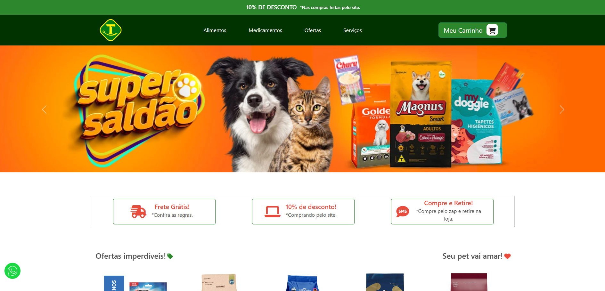
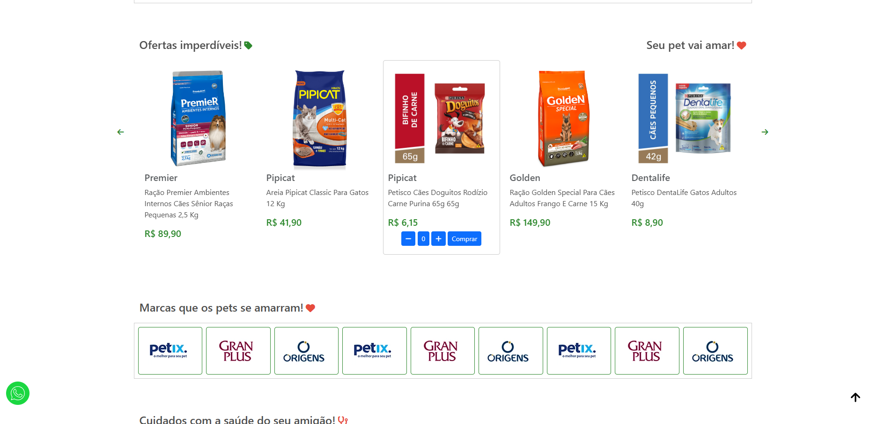

# Lojinha virtual

## Índice
1. [Descrição do Projeto](#descrição-do-projeto)
2. [Motivação](#motivação)
3. [Funcionalidades](#funcionalidades)
4. [Tecnologias Utilizadas](#tecnologias-utilizadas)
5. [Conheça o projeto](#Conheça-o-projeto)

## Descrição do Projeto
Este projeto teve como objetivo desenvolver um site simples porém funcional para uma loja de agropecuária, oferecendo uma experiência de usuário rica e interativa. O site inclui uma landing page atrativa, funcionalidades de carrinho de compras e um carrossel interativo, além de permitir que os clientes escolham seus produtos diretamente pelo site. A interface é responsiva, garantindo uma ótima experiência em dispositivos móveis e desktops.

## Motivação
Projeto desenvolvido com o intuito de aprimorar meus conhecimentos e me desenvolver na área da programação. Acredito que, ao investir tempo e esforço no estudo contínuo, poderei evoluir minhas habilidades técnicas e contribuir de forma significativa para projetos desafiadores e inovadores.

## Funcionalidades
- Landing page completa
- Carrinho de compras
- Carrossel interativo
- Ligação pelo telefone
- Design responsivo

## Temas que foram abordados no projeto 
1. Landing page completa:
- Criação de uma página inicial impactante com informações essenciais sobre o restaurante, imagens de alta qualidade e chamadas para ação.

2. Carrinho de compras:
- Implementação de um sistema de carrinho de compras que permita aos clientes selecionar e visualizar os itens escolhidos antes de finalizar a compra.

7. Design responsivo:
- Garantia de que o site seja totalmente responsivo, adaptando-se perfeitamente a diferentes tamanhos de tela, desde smartphones até desktops.

8. Publicação do site:
- Publicação do site finalizado em uma plataforma de hospedagem, tornando-o acessível ao público.

## Objetivo final do projeto
- Projeto de loja virtual funcional, proporcionando uma excelente experiência para os clientes. O design responsivo e as diversas funcionalidades implementadas garantirão que o site atenda às necessidades da loja e de seus clientes.

## Tecnologias Utilizadas 
     

## [Conheça o projeto](https://antonybsb.github.io/lojinhaPet/) 

